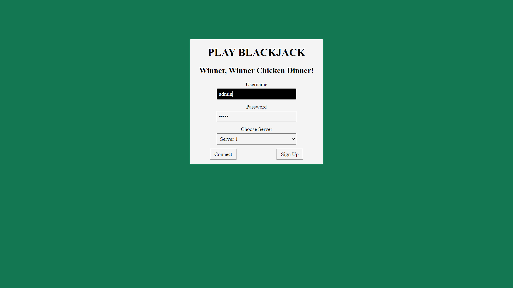
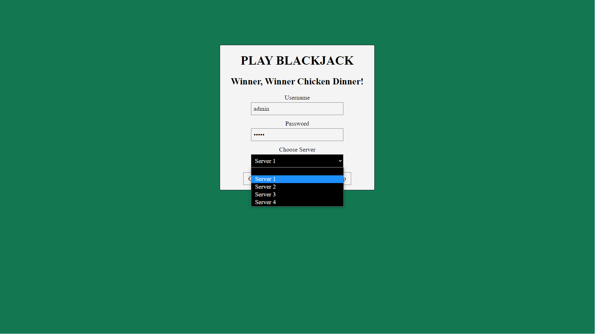
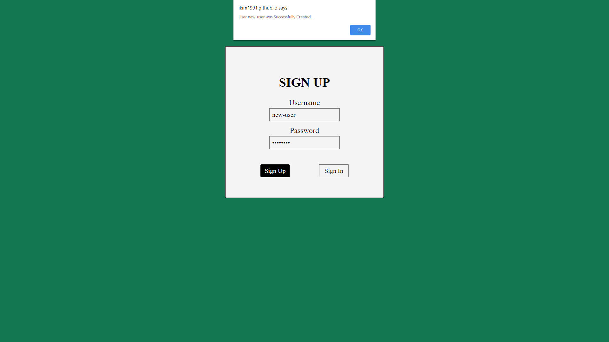
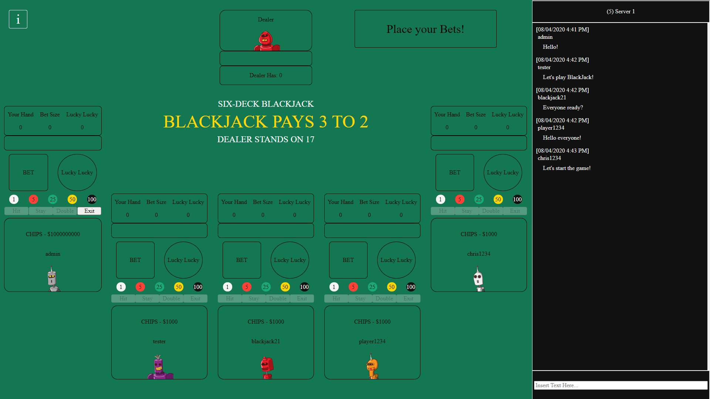
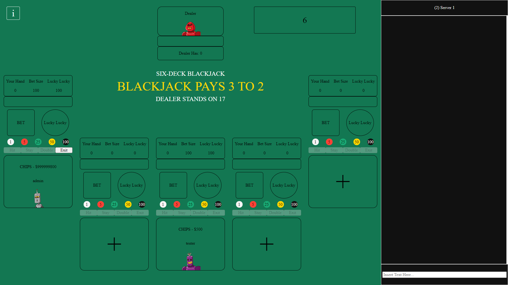
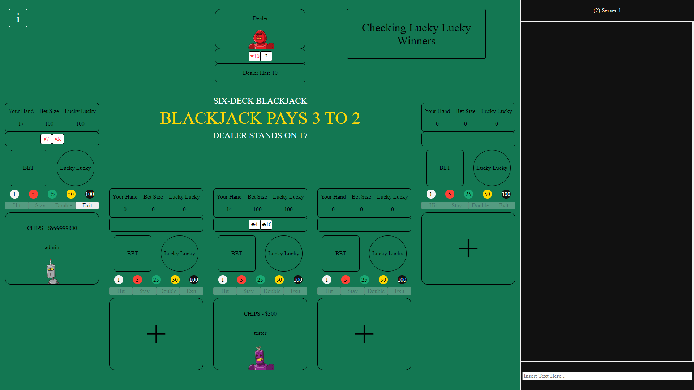
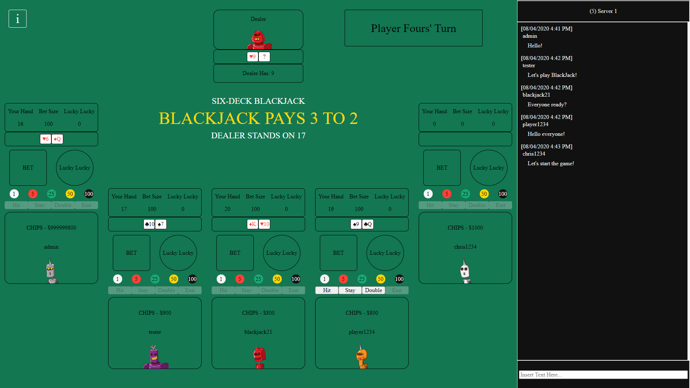
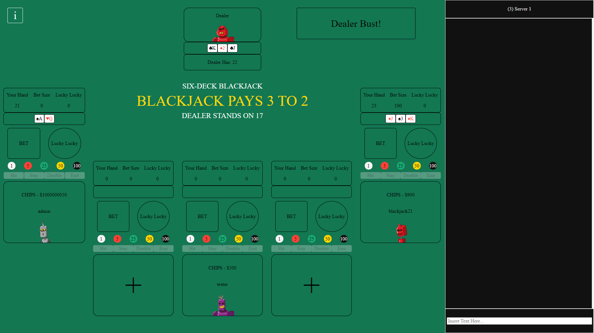
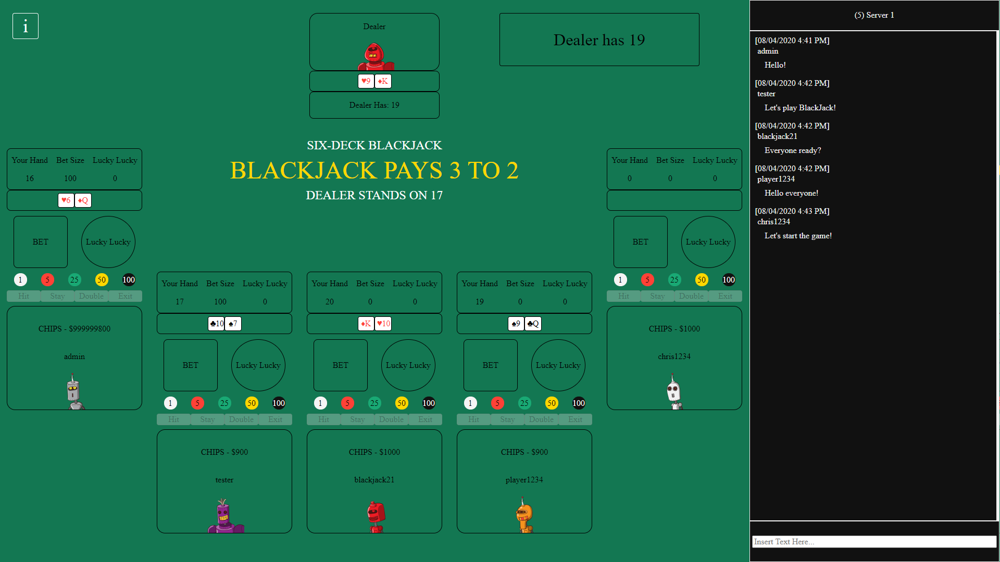
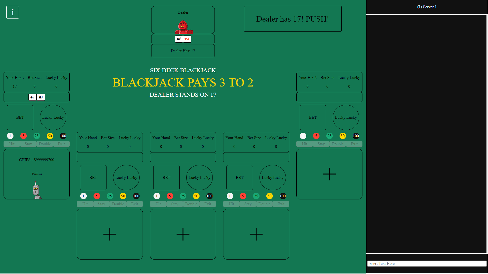

# Interactive BlackJack Front-end App  

### Summary  

The front-end web application is hosted on GitHub using GitHub pages.  
[Website Link](https://ikim1991.github.io/interactive-blackjack-app/)  

The back-end application is hosted on Heroku using its free-tier plan. This may cause the first login to take a few seconds to load as the app is put to sleep after 30 minutes of inactivity.  
[GitHub Repo Link](https://github.com/ikim1991/interactive-blackjack-api/)  

The Front-end was built using React and Redux.  

The web application contains:
  - Login and Register features
  - Multiple Servers to choose from
  - Interactive chat messenger in game
  - Game of 6-deck BlackJack, up to 5 players  

The game plays best on 16:9 aspect ratio resolutions.  
The game is currently not supported on mobile and tablets.  
Minimum screen resolution width of 1024px required.  

### Images  

  
The main Login Page (Screenshot from 1920x1080 resolution)  

  
Choose from different servers to join (Screenshot from 1920x1080 resolution)  

  
Register Page (Screenshot from 1920x1080 resolution)  

  
Game Rules (Screenshot from 1920x1080 resolution)  

  
Lobby (Screenshot from 1920x1080 resolution)  

  
Betting Phase (Screenshot from 1920x1080 resolution)  

  
Checking for Lucky Lucky Winners (Screenshot from 1920x1080 resolution)  

  
Gameplay 1 (Screenshot from 1920x1080 resolution)  

  
Gameplay 2 (Screenshot from 1920x1080 resolution)  

  
Dealer (Screenshot from 1920x1080 resolution)  

  
Dealer Push (Screenshot from 1920x1080 resolution)  

### License  

The MIT License (MIT)  

Copyright 2020 Chris Kim  

Permission is hereby granted, free of charge, to any person obtaining a copy of this software and associated documentation files (the "Software"), to deal in the Software without restriction, including without limitation the rights to use, copy, modify, merge, publish, distribute, sublicense, and/or sell copies of the Software, and to permit persons to whom the Software is furnished to do so, subject to the following conditions:  

The above copyright notice and this permission notice shall be included in all copies or substantial portions of the Software.  

THE SOFTWARE IS PROVIDED "AS IS", WITHOUT WARRANTY OF ANY KIND, EXPRESS OR IMPLIED, INCLUDING BUT NOT LIMITED TO THE WARRANTIES OF MERCHANTABILITY, ITNESS FOR A PARTICULAR PURPOSE AND NONINFRINGEMENT. IN NO EVENT SHALL THE AUTHORS OR COPYRIGHT HOLDERS BE LIABLE FOR ANY CLAIM, DAMAGES OR OTHER LIABILITY, WHETHER IN AN ACTION OF CONTRACT, TORT OR OTHERWISE, ARISING FROM, OUT OF OR IN CONNECTION WITH THE SOFTWARE OR THE USE OR OTHER DEALINGS IN THE SOFTWARE.  
